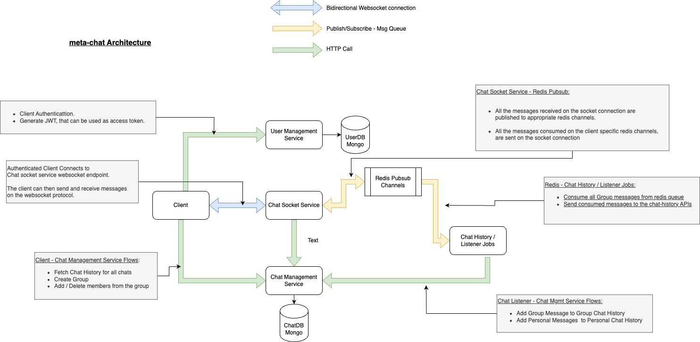
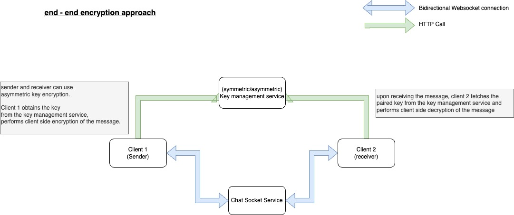
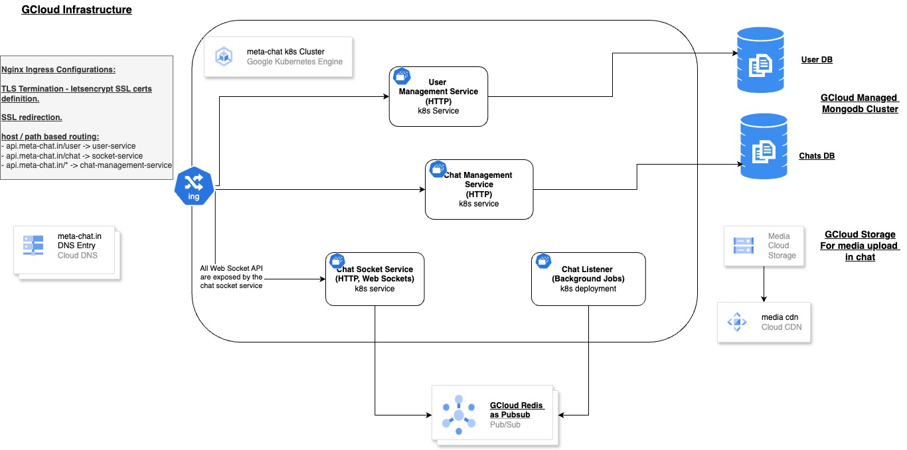
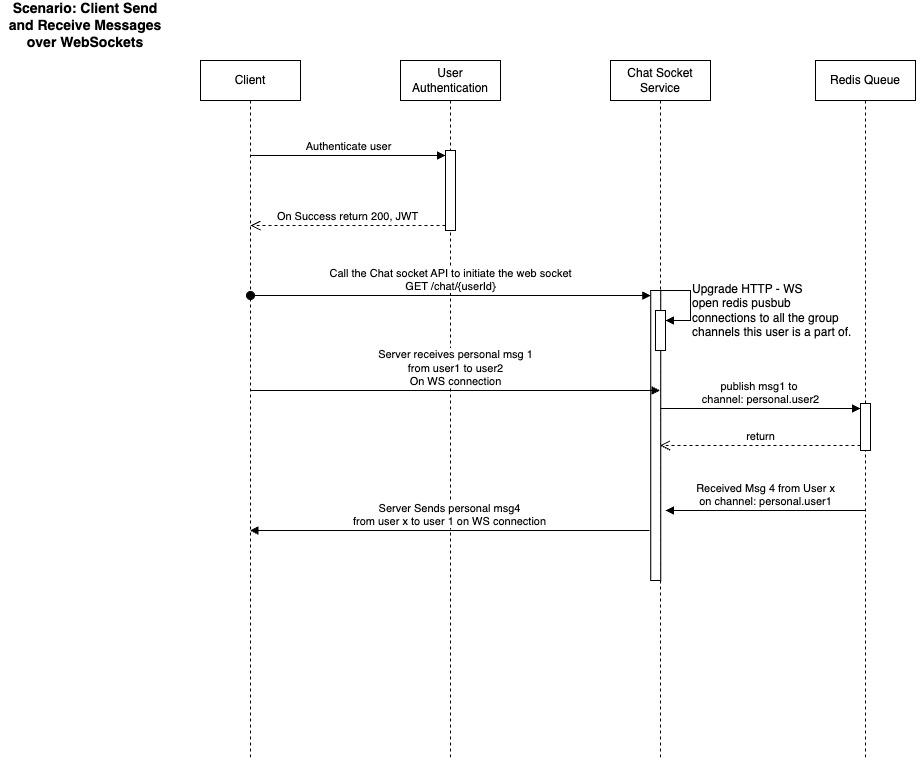
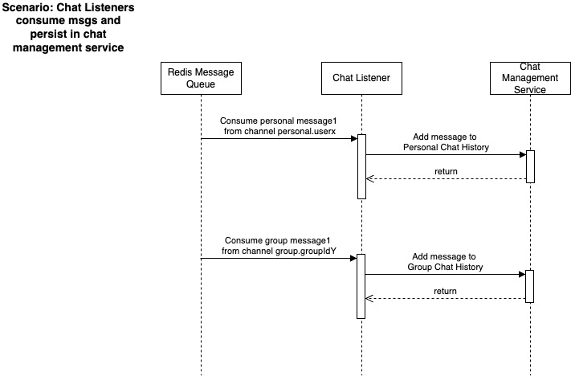

# meta-chat

meta-chat project consists of  a websockets based realtime chat service, user management service and a chat management service.

Following are the design documents relevant to this app.

## Architecture:

## Extension to support E2E encryption:

## Cloud Infrastructure Diagram:

## Sequence Diagrams:

